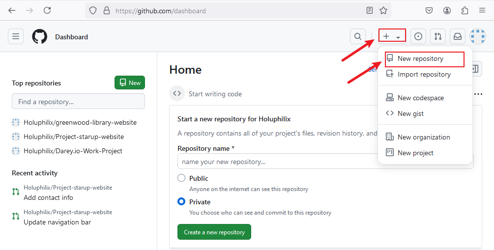
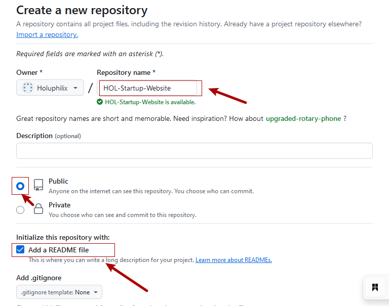
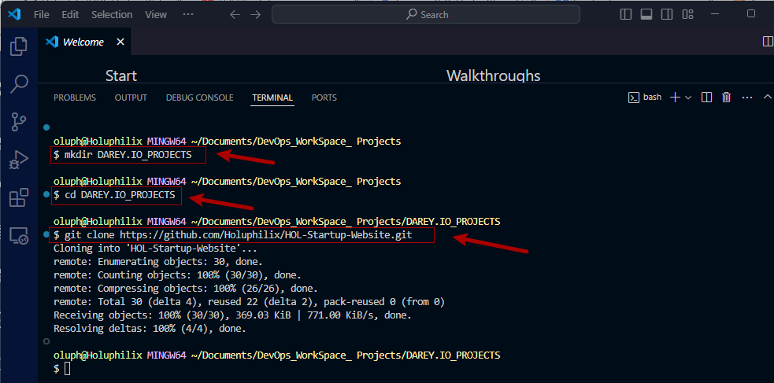
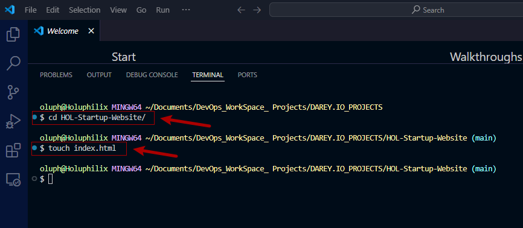
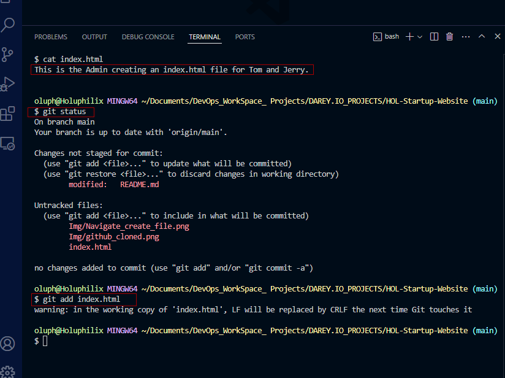
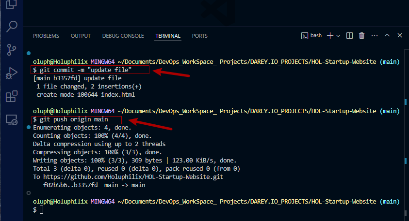
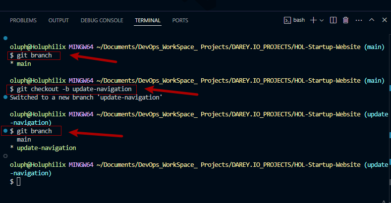
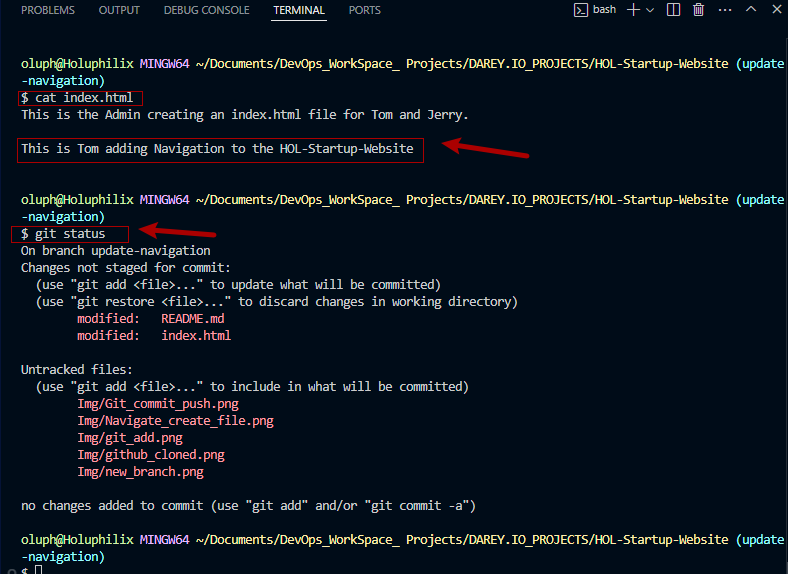
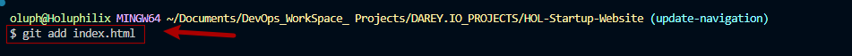

# Basic Git Commands

In this mini Project, I will create a step-by-step project to simulate the workflow of Tom and Jerry using Git and GitHub. This hands-on project will include installation of Git, setting up a GitHub respository, cloning the repository, creating branches, making changes, and merging those changes back into the main branch

### Part 1: Setup and Intial Configuration

#### 1. Install Git:
- Visit the official Git Webisite (https://git-scm.com/downloads) and download the version of Git for your operating system. Follow the installation instruction.

#### 2. Create a GitHub Repository

- Sign up or log in to GitHub
   
- Click the "+" icon in the top-right corner and select "New repository."

- Name your repository (HOL-Startup-Website) and initialize it with a README file.
  

- "Create repository"
  
  

  #### 3. Clone the Repository

- On your repository's page on GitHub, click the "Code" button and copy the HTTPS URL.
  
  

- Open your Git bash terminal or command Prompt
  
- Create a folder named "DAREY.IO_PROJECTS related work

- Change directory into the "DAREY.IO_PROJECT"
  
- Clone (Download) the repository from using 

###### Git clone [Past the URL copied from GitHub]

#### Part 1

- Navigate to HOL-Startup-Website
- Create a empty file "index.html"

- Add the content "This is the Admin creating an index.html file for jerry
- Check changes has not been staged
- Git add index.html

- Commit changes 
- Push main branch to Github
  

### Part 2: Simulating Tom and Jerry's Work

1. Tom's Work
- Navigate to the project directory you just cloned
- Git branch
- Git checkout -b update-navigation 

- Add the content below
- Check changes has not been staged
- Status Tom's changes
- Confirm changes have been stagged for commit.

- Git add Tom's changes
  

- Commit Tom's changes
- Git push origin to GitHub

After completing Tom's workflow, you will now simulate jerry's contribution to the project. To do this, you'll

- switch back to the main branch 
- create a new branch for jerry
- make changes, and then
- stage, commit, and push these changes to GitHub.

1. Jerry's Work
   
- Switch Back to the Main Branch:

1. Jerry's Work:
- Switch Back to the Main Branch:
- 